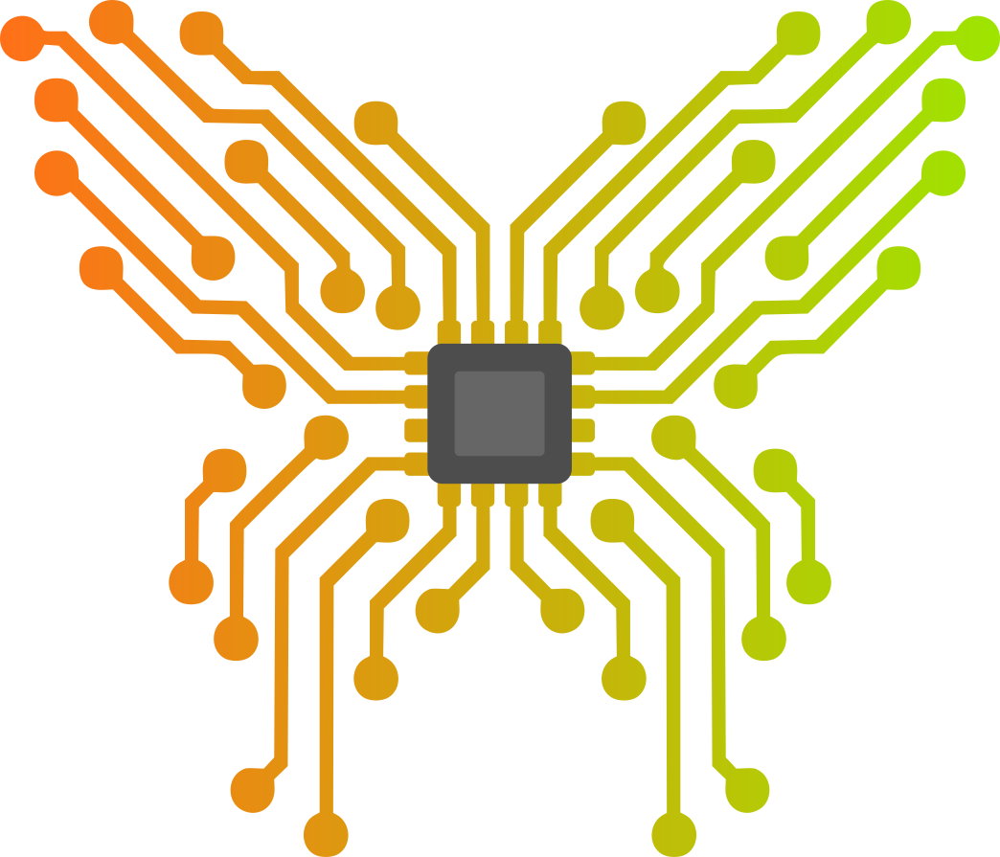

# [Butterware](https://github.com/ve5li/butterware)

Butterware is a firmware for split wireless keyboards, designed as an easy-to-use alternative to [ZMK](https://github.com/zmkfirmware/zmk). Unlike ZMK, which can be complex and challenging to work with, Butterware is focused on providing a comprehensive set of features that are simple to understand, configure, and extend.

Butterware is written entirely in [Rust](https://www.rust-lang.org/) and is based on [Embassy](https://github.com/embassy-rs/embassy), which is designed for creating embedded applications in Rust. Both Embassy and Butterware make heavy use of Rust's async/await, enabling it to run quickly and efficiently.

# Features
- **Layers**: A layer is a set of key bindings that can be enabled/disabled by other keys, similar to other firmware like QMK.

- **Tap hold keys**: Keys can be bound to trigger different actions depending on if they were pressed for a short time or held.

- **RGB lighting**: Butterware supports LEDs that implement the ws2812b protocol.

- **Dynamic master selection**: On boot, the two halves of the keyboard will dynamically determine which side connects to your device. This feature helps prevent one side's batteries from draining faster than the other.

- **Full Rust**: Butterware defines boards using pure Rust code, giving you complete freedom to add new behaviors or features. At the same time, it takes advantage of the many great features that Rust brings, like memory safety and a strong type system.

- **Simple build system**: Since everything is written in Rust, you only need to have the Rust tool chain and `arm-none-eabi-objcopy` installed.

# Building

Unlike QMK, Butterware is always compiled for a specific side, so you need to specify which side to build for. For example, to build the firmware for the left side of the [Butterboard](https://github.com/vE5li/butterboard), you might run:

`make KEYBOARD=butterboard SIDE=left`

There is also a helper command to build for both sides at the same time:

`make both KEYBOARD=butterboard`

# Flashing

Flashing Butterware is easy when you use the [Adafruit nRF52 Bootloader](https://github.com/adafruit/Adafruit_nRF52_Bootloader). Simply connect the board to your device and enter flashing mode by connecting the reset and ground pins twice. In flash mode, the board presents itself as a storage device. You can then copy the binary at `images/butterware-<left/right>.uf2` onto the device to flash it.

If you are using Linux, you can also use `make flash`. Assuming your board is connected as `/dev/sda`, you may run:

`make flash KEYBOARD=butterboard SIDE=left DEVICE=/dev/sda`

It is recommended to flash both sides to avoid the persistent storage going out of sync, which might cause weird behavior when using the keyboard.
